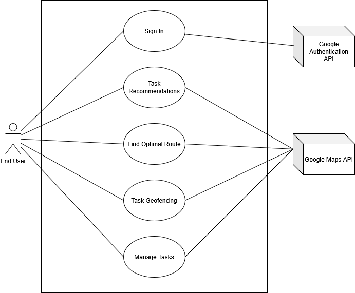
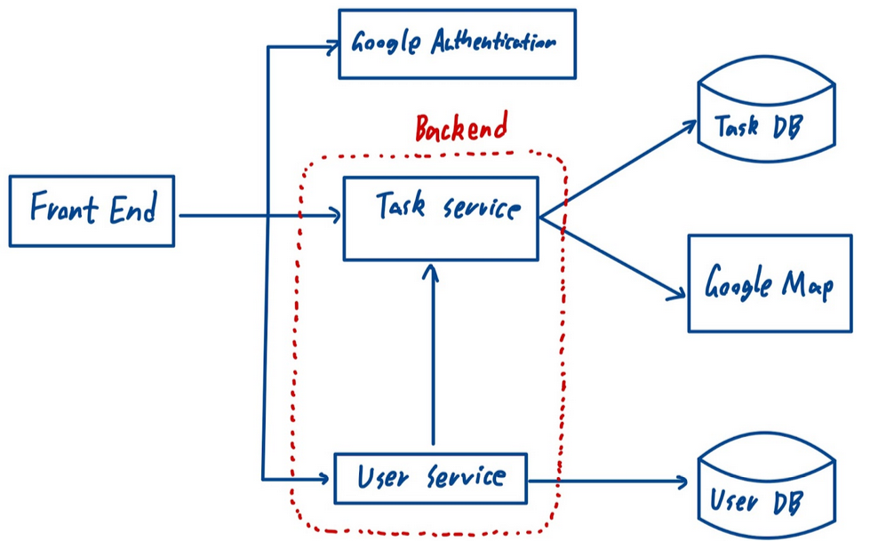
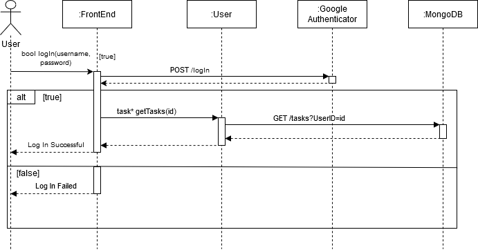
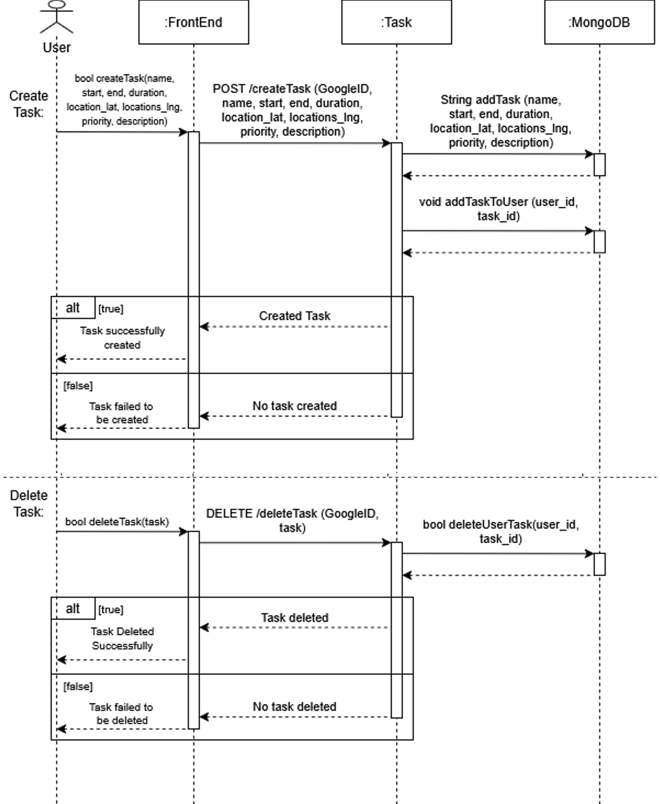
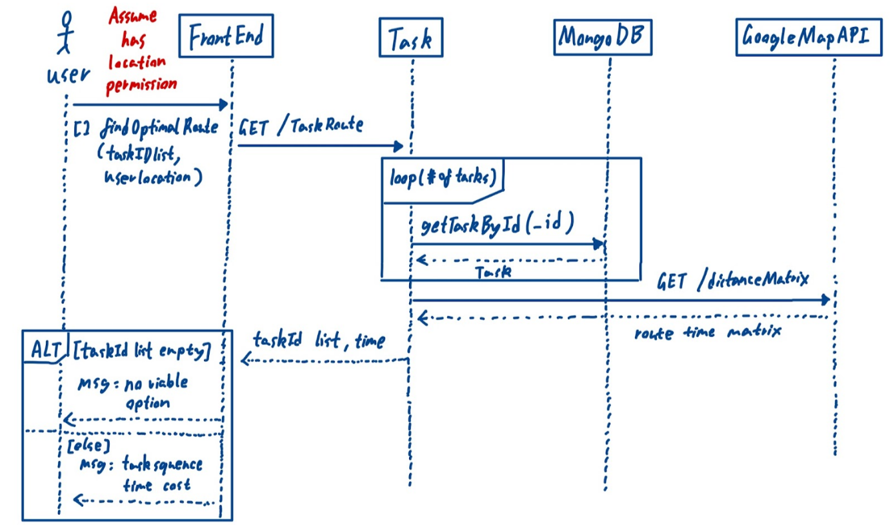
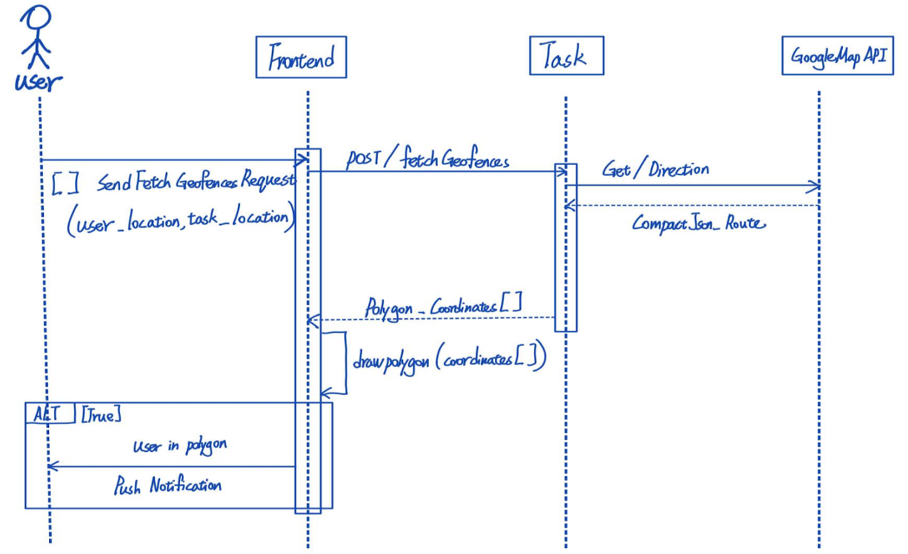
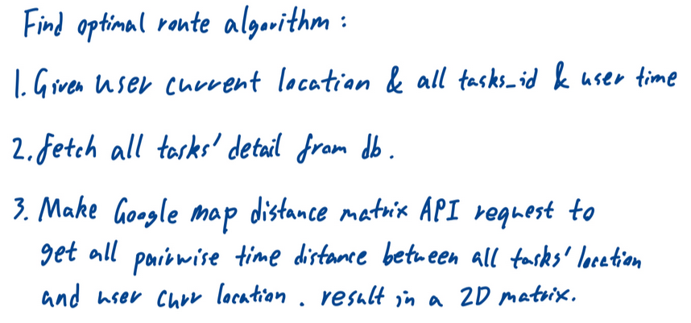
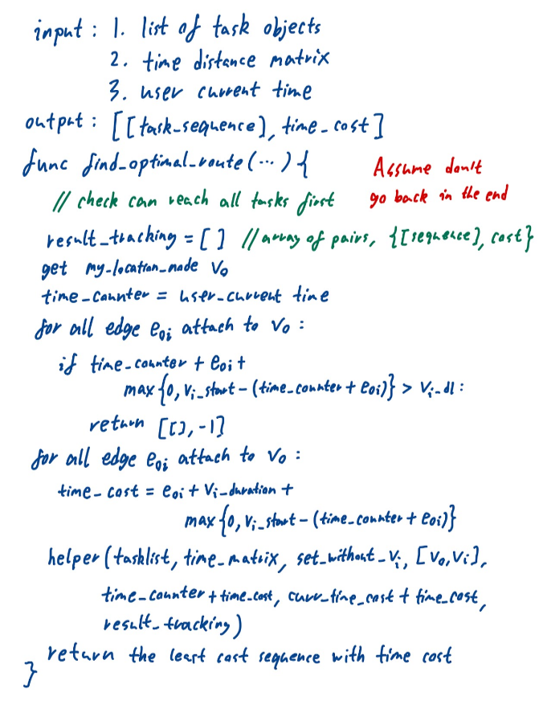
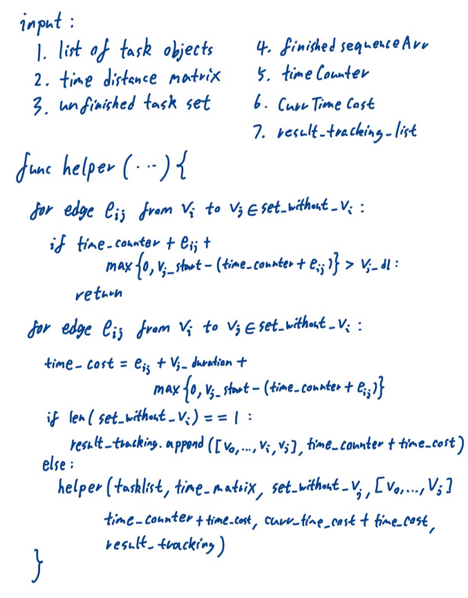

# M4 - Requirements and Design

## 1. Change History

| Version | Date       | Description                                                                                                    | Author               |
|---------|------------|----------------------------------------------------------------------------------------------------------------|----------------------|
| 1.0     | 2025-01-31 | Initial Draft                                                                                                  | Team (4 Coordinates) |
| 2.0     | 2025-02-28 | MVP – Updated use case diagram to more effectively represent the actual use cases.                             | Team (4 Coordinates)                |

**Changed:**
- **Feb 26:** Updated functional requirement for route scheduling (*Find Optimal Route*), formatted success/failure scenarios, created a sequence diagram for route scheduling, and updated the dependency diagram format. *(David)*
- **Feb 27:** Adjusted main complexity to align with current implementation and added pseudo code for the brute force method. *(David)*
- **Feb 28:** Modified Functional Requirement 2 (Task Geofencing) to fit the structure of formal use cases. *(Amaan)*

## 2. Project Description

Managing daily tasks efficiently can be challenging, especially when dealing with multiple locations and deadlines. **GeoTask** is a smart task management app that leverages real-time location data, intelligent scheduling, and AI-powered recommendations to help users organize their tasks seamlessly.

### **Key Features:**
- **Location-Aware Task Management:** Tasks are mapped to specific locations, enhancing visualization and organization.
- **Smart Notifications:** Users receive timely reminders based on proximity, deadlines, and priority via real-time geofencing and scheduling algorithms.
- **Route and Schedule Optimization:** Automatically generates the most efficient task sequence and route based on the user's task list.

## 3. Requirements Specification

### **3.1. Use-Case Diagram**

### **3.2. Actors Description**
1. **End User:** Logs in, manages tasks, and receives notifications based on proximity and prior task history.
2. **Google Maps API:** Handles location data, distance calculations, and navigation.
3. **Google Authentication API:** Manages secure user sign-in and integrates credentials with MongoDB for user identification and data storage.

### 3.3. Functional Requirements

#### Sign In
- **Description:** Users log in via Google authentication and retrieve previously stored tasks.
- **Primary Actor:** End User
- **Success Scenarios:**
  1. User inputs Google credentials in the sign-in window.
  2. User successfully logs in with their credentials.
  3. The system retrieves and displays the user’s tasks.
- **Failure Scenarios:**
  1. **1a.** User cancels authentication.  
     **1a1.** System prompts the user to restart authentication.
  2. **2a.** User inputs invalid credentials.  
     **2a1.** System prompts the user to re-enter valid credentials.

#### Task GeoFencing
- **Description:** Sends push notifications when a task deadline is approaching or when the user enters a task’s designated area (geographical circles).
- **Primary Actor:** End User
- **Success Scenarios:**
  1. The user adds a task that includes a geofencing area.
  2. A POST request is received by the server with valid geofence coordinates.
  3. The server calculates the geofence boundaries based on the provided coordinates.
  4. The calculated geofence coordinates are sent to the user.
  5. The geofence boundary is displayed on the map view as a shaded polygon.
  6. The app tracks the user’s current location through location updates.
  7. When the user enters the designated geofence boundary, a push notification is sent.
- **Failure Scenarios:**
  1. **1a.** The task’s geofence location is invalid (out of bounds).  
     **1a1.** The server returns an error message indicating “Invalid coordinate.”
  2. **6a.** The user has not enabled necessary location permissions.  
     **6a1.** The system prompts the user to enable location permissions to allow geofence tracking.

#### Manage Tasks
- **Description:** Create, modify, or delete a task with details such as deadline, location, priority level, frequency, and a short description.
- **Primary Actor:** End User
- **Success Scenarios:**
  - **Add Task:**
    1. User clicks the add task button.
    2. User inputs task details including name, description, start time, end time, duration, location, and priority.
    3. The updated task list displays the newly added task.
  - **Delete Task:**
    1. User selects an existing task from the Task View and long presses on it.
    2. A pop-up prompts the user to delete or edit the task.
    3. User clicks "Delete Task."
    4. The task is removed from the task list.
- **Failure Scenarios:**
  - **Add Task:**
    1. **2a.** User inputs invalid longitude & latitude.  
       **2a1.** Prompt the user to “Input valid location.”
    2. **2b.** User fails to input some fields.  
       **2b1.** Depending on the field, prompt the user to input a proper value or use a default.
  - **Delete Task:**  
    *(No specific failure scenarios provided.)*

#### Find Optimal Route
- **Description:** Create the shortest viable task schedule with a route using selected tasks based on their start time, deadline, location, and estimated duration.
- **Primary Actor:** End User
- **Success Scenarios:**
  1. The user selects tasks and clicks the findOptimalSequence button.
  2. The system returns an optimal task sequence with the corresponding total time cost estimate.
- **Failure Scenarios:**
  1. **1a.** The system fails to generate a route due to missing input (e.g., empty task list or missing user location).  
     **1a1.** The system prompts the user to try again.
  2. **2a.** If no task sequence is viable.  
     **2a1.** The system displays a message indicating no task sequence is possible under the current configuration and prompts the user to try again.

### **3.4. Non-Functional Requirements**
1. **Scalability:** Must support at least **1,000 concurrent requests** with a response time under **200 milliseconds**.
2. **Real-Time Location Processing:** Must process location updates in the background with minimal battery consumption.
3. **Notification Accuracy:** Must deliver push notifications within **2 seconds** of detecting task deadlines or proximity triggers.
4. **Location Accuracy:** Must use location data with an accuracy of at least **10 meters**.

## 4. Designs Specification

### **4.1. Main Components**
1. **User**
   - **Description:** Handles user authentication, account management, and interaction with the Android UI. Users log in via Google Authentication and access their cloud-saved tasks.
   - **Purpose:** Ensures secure access and streamlined task management by linking user login data with task storage.
2. **Task**
   - **Description:** Enables creation, modification, and deletion of tasks, enhanced by real-time geofencing and dynamic scheduling.
   - **Purpose:** Boosts productivity by minimizing travel time and automating task scheduling based on location, priority, and deadlines.

### **4.2. Databases**
- **MongoDB**
  - **Description:** A NoSQL database.
  - **Purpose:** Store user-created tasks so that the user can access their tasks across multiple devices. This was chosen because of its simplicity compared to relational databases as well as the resiliency NoSQL can provide against network interruptions.

### **4.3. External Modules**
- **Google Maps API**
  - **Purpose:** Handles location data, calculates distances, and aids in navigation.
- **Google Authentication API**
  - **Purpose:** Manages secure user login and integrates credentials with task storage.

### **4.4. Frameworks**
1. **AWS**
   - Provides high availability with pre-configured tools and reduces infrastructure management overhead via AWS EC2.
2. **Docker**
   - Ensures consistent performance across different environments and reduces deployment times.

### **4.5. Dependencies Diagram**

### **4.6. Functional Requirements Sequence Diagram**
Sign In:

Task Management:

Find Least Travel Time Route:

Task Geofencing:

### **4.7. Non-Functional Requirements Design**
1. **Scalability**: The system will be deployed on a cloud-based infrastructure with efficient logic and auto-scaling mechanisms to handle up to 1,000 concurrent requests. Efficient database indexing and caching techniques will be implemented to maintain response times under 2 seconds.
2. **Real-Time Location Processing**: The application will use optimized background location tracking with adaptive update intervals, leveraging Google Map API on Android.
3. **Notification Accuracy**: A real-time event-driven architecture with WebSockets will be used to ensure push notifications are delivered within 2 seconds. Task deadlines and proximity triggers will be preprocessed to reduce computation overhead during runtime.
4. **Location Accuracy**: The app will integrate GPS, Wi-Fi, and cellular network data to achieve at least 10-meter accuracy.

### **4.8. Main Project Complexity Design**
#### **Task Scheduling with Time Window Constraints**
- **Problem Definition**: Given a set of tasks (currently limited to within the same day) with location, start time, deadline, and estimated duration, the system must find the optimal order of execution to minimize travel time while ensuring all tasks are completed before their deadlines.
- **Challenges:**
    - The problem resembles the Traveling Salesman Problem (TSP) with Time Windows, which is NP-hard.
    - Tasks may have overlapping or conflicting deadlines, requiring dynamic adjustments.
    - Optional real-time traffic data will give a more accurate estimate, but comes at a much higher performance cost.
- **Proposed Solution:**
    - Bruteforce approach + Early stopping:
        - Start from the current user location and recursively explore all possible combinations. If at any point an unfinished task can no longer be reached before end time, it will be stopped early to reduce unnecessary computation.
        - Given the number tasks is small (generally less than 6), the computation cost is manageable.
        - Pseudo code:

