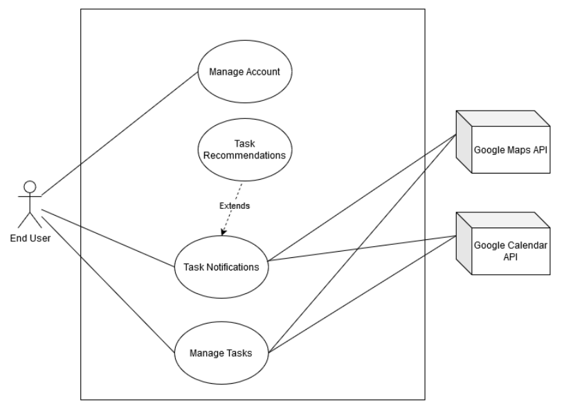
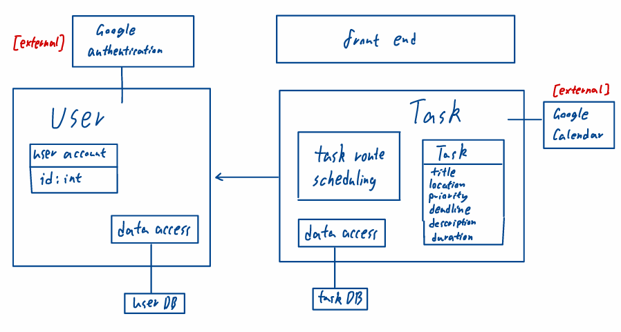
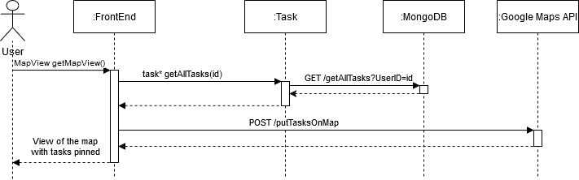
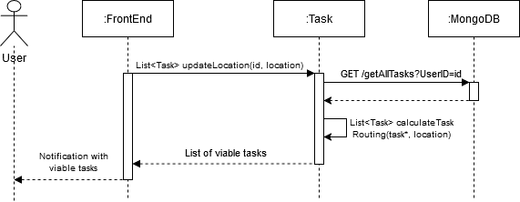
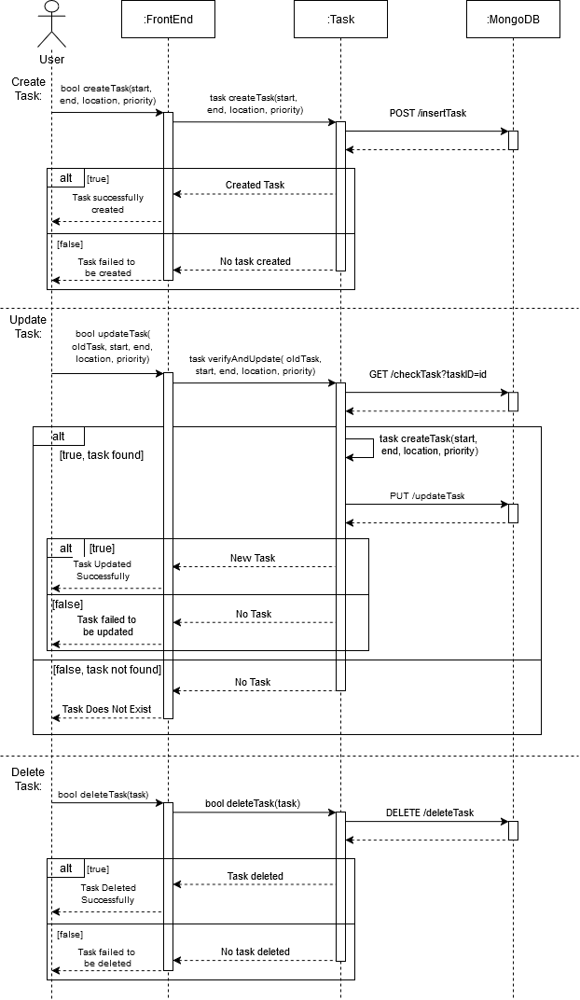

# M3 - Requirements and Design

## 1. Change History

| Version | Date       | Description    | Author       |
|---------|------------|----------------|--------------|
| 1.0     | 2025-01-31 | Initial Draft  | Team (4 Coordinates) |

## 2. Project Description

Managing daily tasks efficiently can be challenging, especially when dealing with multiple locations and deadlines. **GeoTask** is a smart task management app that leverages real-time location data, intelligent scheduling, and AI-powered recommendations to help users organize their tasks seamlessly.

### **Key Features:**
- **Location-Aware Task Management**: Tasks are mapped to specific locations, providing better visualization and enabling more efficient organization.
- **Smart Notifications**: Users receive timely reminders based on proximity, deadlines, and priority, utilizing real-time geofencing and scheduling algorithms.
- **Route and Schedule Optimization**: Automatically generates the most efficient task sequence and route based on the user's task list.
- **Efficient Task Generation**: Users can create tasks by simply writing a short text message with details like time, location, and frequency, eliminating the need for manual input.

## 3. Requirements Specification

### **3.1. Use-Case Diagram**

### **3.2. Actors Description**
1. **End User**: Can log in, manage their tasks, and receive notifications about their tasks when they are within a certain proximity based on set priority, as well as receive notifications about tasks our app recommends they do based on prior history.
2. **Google Maps API**: The API the app will use to handle location data and distance to certain tasks, as well as be called upon for navigation.
3. **Google Calendar API**: The API the app will use to store and handle calendar and task data. 

### **3.3. Functional Requirements**

#### **1. User Login/Secure User Authentication**
- **Description**: Users log in via Google authentication and are able to retrieve previously stored tasks.
- **Primary Actor**: End User
- **Success Scenarios:**
    1. The user provides valid Google credentials and successfully logs in.
    2. The system retrieves and displays the user's stored tasks.
- **Failure Scenarios:**
    1. Incorrect login credentials result in authentication failure.
    2. Google authentication service is unavailable.

#### **2. Task Notifications**
- **Description**: Send push notifications to alert the user when a task deadline is approaching or when they enter a task’s designated area (geographical circles).
- **Primary Actor**: End User
- **Success Scenarios:**
    1. The system detects an upcoming task deadline and sends a notification.
    2. The user enters a predefined task location, triggering a notification.
- **Failure Scenarios:**
    1. Notification service failure prevents alerts from being sent.
    2. The system fails to detect the user's location due to GPS issues.

#### **3. Task Management System**
- **Description**:  Create/delete/modify a task with information such as deadline, location, priority level, frequency and a short description.
Primary actor: End User
- **Primary Actor**: End User
- **Success Scenarios:**
    1. The user successfully creates a new task with required details.
    2. The user edits and saves an existing task.
    3. The user deletes a task successfully.
- **Failure Scenarios:**
    1. Task creation fails due to missing or invalid input.
    2. Task update fails due to network or system errors.

#### **4. Intelligent Route Scheduling**
- **Description**: Create a viable route schedule using selected tasks based on deadline, location, and priority level.
- **Primary Actor**: End User
- **Success Scenarios:**
    1. The user selects tasks, and the system generates an optimized route.
    2. The system considers time, distance, and priority while creating the schedule.
- **Failure Scenarios:**
    1. The system fails to generate a route due to incomplete task details.
    2. The route optimization service is unavailable.

#### **5. Dynamic Geofencing for Task Alerts**
- **Description**:  Dynamically adjust geofences (circular regions) on a map based on task locations, priority levels and proximity. If a user enters the geofenced area, they receive a task reminder notification. Users do not need to manually adjust geofences, as the system intelligently adapts based on the importance of the task.
- **Primary Actor**: End User
- **Success Scenarios:**
    1. The system continuously monitors task locations and priority levels, dynamically adjusting the geofence radius in real-time.
    2. The system updates the map and recalculates proximity alerts accordingly
- **Failure Scenarios:**
    1. The system encounters an algorithmic failure, preventing geofence updates.
    2. The modification is not saved due to an internal system issue.

#### **6. Map View for Tasks**
- **Description**: Displays tasks on a map with deadline, priority level, and frequency details.
- **Primary Actor**: End User
- **Success Scenarios:**
    1. The system displays tasks on the map with relevant information.
    2. Geofencing is seamlessly integrated into the map.
- **Failure Scenarios:**
    1. The system fails to load the map due to API or service issues.

### **3.4. Non-Functional Requirements**
1. **Scalability**: The system must support at least **1,000 concurrent requests** while maintaining a response time of under **2 seconds**. This is critical to ensure smooth performance as the number of users grows, preventing slowdowns and crashes under high load.
2. **Real-Time Location Processing**: The application must process **location updates in the background** with minimal battery consumption. This is essential to provide accurate and timely notifications to users while ensuring the app does not drain device resources excessively.
3. **Notification Accuracy**: The system must deliver push notifications to users within **2 seconds** of detecting task deadlines or proximity triggers. This ensures timely alerts, which are critical for user engagement and task management efficiency.
4. **Location Accuracy**: The app must use location data with an accuracy of at least **10 meters** to ensure proximity-based notifications and route planning are reliable and useful for the user.

## 4. Designs Specification

### **4.1. Main Components**
1. **User**
    - **Description**: Handles user authentication, account management, and interaction with the Android UI. Users log in via Google Authentication, manage their accounts, and access their cloud-saved tasks.
    - **Purpose**: Ensures secure access, allowing users to manage their profiles and seamlessly interact with the app. Google Authentication API was chosen for enhanced security and to reduce development overhead. User login information is also linked to database organization, serving as labels for storing and retrieving user-specific task data. 
2. **Task**
    - **Description**: Provides users with a comprehensive system to create, modify, and delete tasks while optimizing task execution through real-time geofencing and dynamic scheduling. The system continuously tracks user location to determine proximity to task locations, dynamically adjusting task order based on real-time conditions such as distance, priority levels, and deadlines.
    - **Purpose**: Enhances productivity by minimizing travel time and ensuring efficient task execution. Real-time geofencing defines virtual boundaries around task locations and triggers alerts when users enter or leave task zones, ensuring location-based task reminders. Task scheduling intelligently arranges tasks based on their geographic distribution and urgency, providing users with an optimized route for task completion. Automated notifications ensure that tasks are pushed to users at the right time, reducing manual intervention and improving overall efficiency. This was chosen because alternatives like an automated task system don't provide users with direct control over their tasks.

### **4.2. Databases**
- **MongoDB**
    - Description: A NoSQL Database
    - Purpose: Store user-created tasks so that the user can access their tasks across multiple devices. This was chosen because of its simplicity compared to relational databases as well as the resiliency NoSQL can provide against network interruptions.

### **4.3. External Modules**
1. **Google Map API**
    - Purpose: Handles location data, calculates distance, and aids navigation.
2. **Google Calendar API**
    - Purpose: Stores/manages the task scheduling and check scheduling conflict

### **4.4. Frameworks**
1. **AWS**
    - AWS offers high availability and pre-configured tools, and AWS EC2 reduces infrastructure management overhead.
2. **Docker**
    -   Docker ensures that the application runs consistently across different environments. It also reduces deployment times and optimizes resource usage.

### **4.5. Dependencies Diagram**

### **4.6. Functional Requirements Sequence Diagram**

### **4.7. Non-Functional Requirements Design**
1. **Scalability**: The system will be deployed on a cloud-based infrastructure with efficient logic and auto-scaling mechanisms to handle up to 1,000 concurrent requests. Efficient database indexing and caching techniques will be implemented to maintain response times under 2 seconds.
2. **Real-Time Location Processing**: The application will use optimized background location tracking with adaptive update intervals, leveraging Google Map API on Android.
3. **Notification Accuracy**: A real-time event-driven architecture with WebSockets will be used to ensure push notifications are delivered within 2 seconds. Task deadlines and proximity triggers will be preprocessed to reduce computation overhead during runtime.
4. **Location Accuracy**: The app will integrate GPS, Wi-Fi, and cellular network data to achieve at least 10-meter accuracy.

### **4.8. Main Project Complexity Design**
#### **Task Scheduling with Time Window Constraints**
- **Problem Definition**: Given a set of tasks (currently limited to within the same day) with location, start time, deadline, and estimated duration, the system must find the optimal order of execution to minimize travel time while ensuring all tasks are completed before their deadlines.
- **Challenges:**
    - The problem resembles the Traveling Salesman Problem (TSP) with Time Windows, which is NP-hard.
    - Tasks may have overlapping or conflicting deadlines, requiring dynamic adjustments.
    - Optional real-time traffic data will give a more accurate estimate, but comes at a much higher performance cost.
- **Proposed Solution:**
    - Bruteforce approach + Early stopping:
        - Start from the current user location and recursively explore all possible combinations. If at any point an unfinished task can no longer be reached before end time, it will be stopped early to reduce unnecessary computation.
        - Given the number tasks is small (generally less than 6), the computation cost is manageable.
        - Pseudo code:

