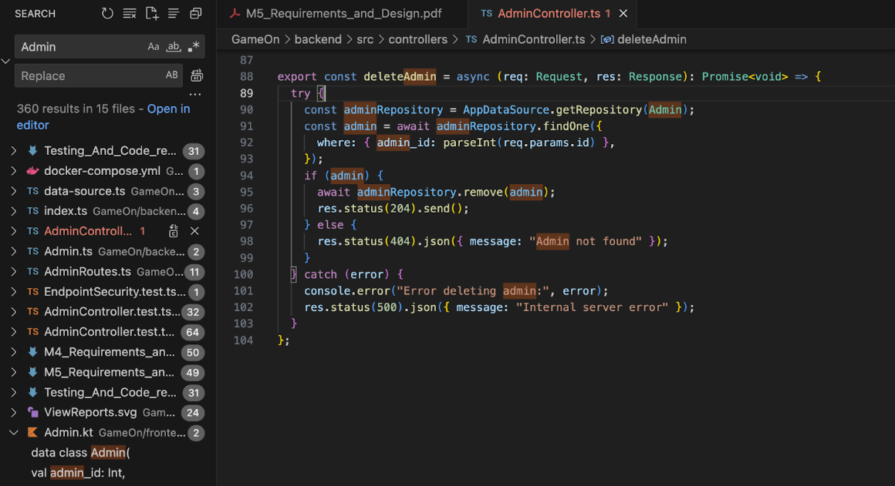

# M5: GameOn Review

## 1. Manual Code Review (Overall: 8.5/10)
## - Front End (8/10)

## Pros

#### **Modularity & Clarity**
- The code is generally well-structured with clear separation between activities and composable functions.
- Naming conventions are descriptive and consistent, aiding readability.

#### **Good Practices**
- Proper use of Jetpack Compose makes UI components concise and declarative.
- Scoped coroutines and features like `@Parcelize` are well used.

#### **User Experience**
- The UI flows in a straightforward manner and provides clear navigation between screens.
- Composable previews and test tags are appropriately placed.

#### **Error Handling & Logging**
- Most API calls and user actions include logging, which is helpful for debugging.
- Basic error handling is present in most API responses.

## Cons

#### **Code Duplication**
- Significant overlap between components in `UserSettingsActivity` and `PreferencesActivity`, particularly in the `UserSettingsComposables` object (e.g., identical region lists and `PreferenceInput` functions).

#### **Error Handling**
- Several `try-catch` blocks catch generic exceptions (`catch(e: Exception)`) without targeting specific failure types, which can mask issues and complicate debugging.
- Some API-related errors are only logged without providing feedback to the user.

#### **Non-null Assertions**
- Frequent use of the non-null assertion operator (`!!`), especially when retrieving extras (e.g., `intent.getStringExtra("DiscordId")!!`) or headers. If these are missing, the app may crash.
- It's safer to use nullable checks or safe-call operators.

#### **State Management**
- UI state is managed directly within `Activities`, which can become difficult to maintain as the app scales.
- Adopting a `ViewModel` and using the MVVM pattern would improve separation of concerns and state management.

#### **Magic Numbers & Hard-Coded Values**
- Arbitrary values (e.g., font sizes, offsets, widths) are hard-coded in UI code.
- Moving these to constants or a centralized theme would improve maintainability and support theming.

## - Back End (9/10)

| **File**            | **Comments**              |
| ----------------------------- | ---------------------------------------------------- | 
| AdminController.ts  |  In the function createAdmin, the code should probably check if the user already has an admin record. This might allow duplicates unless DB constraints prevent it. Edit: The mocked test suite for this file lacks documentation. Potential coverage issue [for other files too].|
 | AuthController.ts | Clear documentation, and a nice format. Variable and function names are understandable and consistent. Functions are in reasonable length. Edit: No mocked test for certain error catch recognized by JEST [although did see tests for some]|
 | GameController.ts | The code is well-structured and easy to follow, with meaningful variable names and consistent error handling across all endpoints. CRUD operations are implemented using TypeORM, and responses follow standard HTTP conventions. |  
 | GroupController.ts |The functions in the code consider lots of edge cases. Not much comment on the functions addDiscordUserToGuild & getGroupMembers, but the names are descriptive enough so don’t matter. Other functions have clear comments on why the code exists. |  
 | MatchmakingController.ts |Not much comment on the functions, but all of the code is clean with meaningful function names and variable names. The code is nice and well-structured and in fine length. Edit: unauthorized error checking is not covered by any test. in checkMatchmakingStatus(), “time-out” case was never covered by any test.
 | PreferencesController.ts | Not much comment on the functions, but all of the code is clean with meaningful function names and variable names. One minor issue: in updatePreferences, the function does not check req.params.id is NaN before calling parseInt.|  
 | ReportController.ts | The code is well-organized, with a clear separation of responsibilities across CRUD operations and consistent error handling using appropriate HTTP status codes. Each function performs a single  |

## 2. Manual Test Review

### 2.1. Test Completeness (All Exposed API Tested, Main Use Case, Error/Edge Case, Correct Assertion)
**Score:** 9.5/10  
All API endpoints are covered. A few function tests and error checks are missing, but overall the test coverage is strong.  

### 2.2. Test Implementation Matches Requirements and Design
**Score:** 9.5/10  
- **Mocked Tests:**  
  - They do cover the scenarios of external failure with Discord or the database for all routes. Most of the lines for catching network 500 errors are covered in the mocked test suites. Test documentation is missing in AuthController.test.ts, and each mocked test is missing mocked behaviour as part of the test spec.
- **Unmocked Tests:**  
  - The tests have sufficient comments explaining all input and expected outcomes and behavior. The test suite is organized into logical groups, with detailed comments explaining each step. Some error handling is implemented, though not for all exceptions. This is expected in unmocked tests.

### 2.3. Test Structure
**Score:** 10/10  
- Test cases are organized into no-mocked, mocked, and non-functional categories. Each category is then split into tests for each purpose. 
The Mocked section is well structured, and each test case only tests one failure scenario at a time. The purpose of each test is also clear.

### 2.4. Test Coverage & Comprehensiveness
**Score:** 9/10  
- Taking into account of their justification for JEST low coverage, if it’s valid, then tests are overall comprehensive. There are a few functions and error catch statements not covered, as mentioned in the detailed breakdown in part a.

### 2.5. Non-Functional Testing
**Score:** 10/10  
- Tests for verifying endpoint security clearly address non-functional requirements. It gives assertion to checks that unauthenticated requests to sensitive routes are correctly rejected with a 401 status.

### 2.6. All backend Tests run automatically⚙️ Automation (CI/CD)
**Score:** 10/10  
- Git action includes all the backend tests and effectively sets up a secure SSH connection, deploys code to an isolated test environment, and runs backend tests using Docker Compose. It also uses commit-specific directories and includes debugging and verification steps.

### Review of Each File:

### Non-functional  Tests

| Test File                  | Summary |
|---------------------------|---------|
| **EndpointSecurity.test**  | The test is a well-structured test suite for verifying endpoint security. It gives assertion to checks that unauthenticated requests to sensitive routes are correctly rejected with a 401 status. |
| **ReportReasonLength.test**   | The test is well-organized, with clear expectations and straightforward input that's easy to follow. |

### Without-Mocks Tests

| Test File                  | Summary |
|---------------------------|---------|
| **AdminController.test**  | Sufficient comments explaining all input and expected outcomes and behavior. The test suite is organized into logical groups, with detailed comments explaining each step and the purpose of every object used in the testing process. All error cases are included for the game API. |
| **GameController.test**   | The test suite includes thorough comments explaining all inputs and expected outcomes. All test cases have detailed explanations for each step and the purpose of every object involved. |
| **GroupController.test**  | Thorough comments and clear explanations for each step and object used in testing. |
| **PreferencesController.test** | The test is clear and easy to follow, with both successful and error scenarios well covered. Comments are provided throughout, and the expected behaviors are documented. |
| **UserController.test**   | The test is clear and easy to follow, with both successful and error scenarios well covered. Comments are provided throughout, and the expected behaviors are documented. |

---

### Mock Tests

| Test File                    | Summary |
|-----------------------------|---------|
| **AdminController.test**    | Tests are documented, and external failure scenarios are all tested (comprehensive). The inputs of test documentation should describe what is fed to the function, not the exact scenarios. Also mocked scenario is missing, but it could be guessed from the description. |
| **AuthController.test**     | Test documentation is missing, but test cases cover most external failure scenarios. One mocked test did not trigger error-catch in handleRegister(). |
| **GameController.test**     | Tests are documented, and external failure scenarios are all tested (comprehensive). The inputs of test documentation should describe what is fed to the function, not the exact scenarios. Also mocked scenario is missing, but it could be guessed from the description. |
| **GroupController.test**    | Tests are documented, and external failure scenarios are all tested (comprehensive). The inputs of test documentation should describe what is fed to the function, not the exact scenarios. Also mocked scenario is missing, but it could be guessed from the description. Backend test suite (mocked & not mocked) did not cover functions addDiscordUserToGuild & getGroupMembers |
| **MatchmakingController.test** | Tests are documented, and external failure scenarios are all tested (comprehensive). The inputs of test documentation should describe what is fed to the function, not the exact scenarios. Also mocked scenario is missing, but it could be guessed from the description. In initiateMatchmaking, unauthorized scenario error catch is never tested. In checkMatchmakingStatus, the “time-out” case is never covered by any test. |
| **PreferencesController.test** | Tests are documented, and external failure scenarios are all tested (comprehensive). The inputs of test documentation should describe what is fed to the function, not the exact scenarios. Also mocked scenario is missing, but it could be guessed from the description. |
| **ReportController.test**   | Tests are well documented except missing “mocked behavior” line. Most external failure scenarios are covered.|
| **UserController.test**     |Tests are documented, and external failure scenarios are all tested (comprehensive). The inputs of test documentation should describe what is fed to the function, not the exact scenarios. Also mocked scenario is missing, but it could be guessed from the description. |

## 3. Automated Code Review

### 3.1. Codacy Runs with the Required Setup
**Score:** 10/10  
Codacy does indeed run, and I can confirm it's working based on the group’s Codacy page.

### 3.2. All Remaining Codacy Issues are Well-Justified
**Score:** 1/10  
Based upon the group’s documentation, they seem to have focused more on writing tests than fixing Codacy problems. While their document says 576 errors, it appears from the updated Codacy numbers on the website that the faulty errors were resolved. As such, they continue to have 60 issues of varying severity, including critical. As a result, while it is understandable that focusing on writing tests was a priority, it does not fully justify the inattention to fix

## 4. Fault: Admin module design in the system
It’s unclear how the Admin class works in the system. In the backend, there are routes and functions for handling admin-related functionality. However in the front end, the Admin class is declared but never used. There’s nowhere in the front-end code that creates or deletes an Admin. Since only the Admin handles reports, it is unclear how this would happen in the real system.
Furthermore, due to the ambiguity above, there is no privilege check in the backend Admin endpoint, before making admin-related changes (create & delete). This is a serious problem, as anyone could make themselves admin and ban other users.

