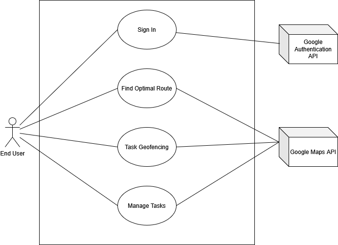
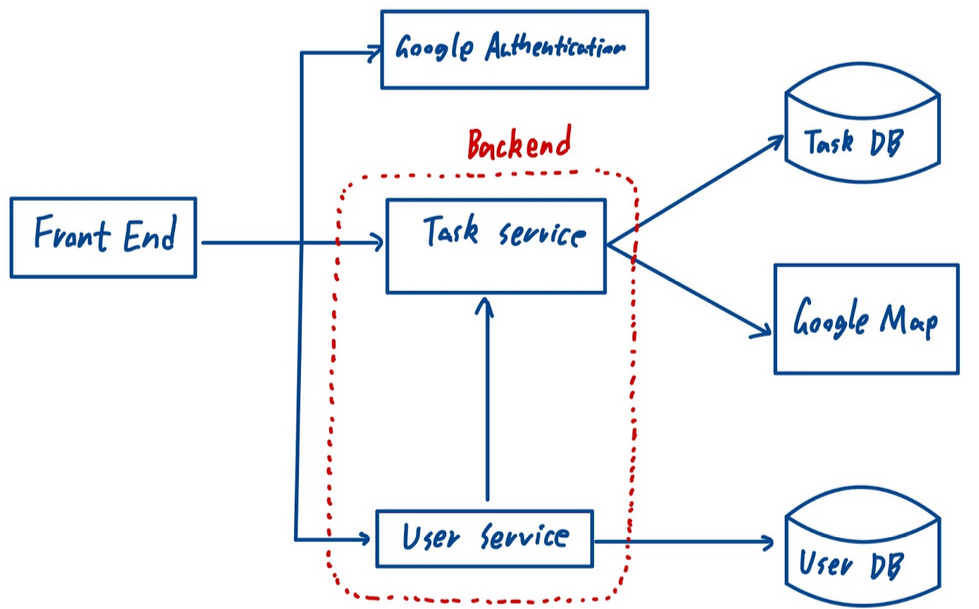

# M4 - Requirements and Design

## 1. Change History

| Version | Date       | Description                                                                                                    | Author               |
|---------|------------|----------------------------------------------------------------------------------------------------------------|----------------------|
| 1.0     | 2025-01-31 | Initial Draft                                                                                                  | Team (4 Coordinates) |
|---------|------------|----------------------------------------------------------------------------------------------------------------|----------------------|
| 2.0     | 2025-02-28 | MVP – Updated use case diagram to more effectively represent the actual use cases.                             | Team (4 Coordinates) |
|         |            | - Add sequential diagrams for Task Geofencing and find the Optimal Route. | |
| | | - Modified Api endpoint in managing task sequential tasks. | |
| | | - Add detailed success/failure scenarios to all functional requirements based on feedback. | |
| | | - Dependency diagram update with more components (user&task) and connect them with DB. | |
| | | - Added Google Authentication API as one of our main actors. | |
| | | - Removed Google Calendar API as one of our main actors as it is beyond MVP. | |
| | | - Updated main complexity such that it aligns with the current implementation. Also added pseudo code for the proposed solution. | |
|---------|------------|-----------------------------------------------------------------------------------------------------------------|----------------------|
| 3.0 | 2025-03-02 | Final Release | Team (4 Coordinates) |
| | | - Removed Task Recommendation Use Case from diagram | |
| | | - Added Update Task to the Manage Task use case. | |
| | | - Updated small details of the Add Task use case to be more clear. | |
| | | - Updated small details of the Delete Task use case to be more clear. | |

## 2. Project Description

Managing daily tasks efficiently can be challenging, especially when dealing with multiple locations and deadlines. **GeoTask** is a smart task management app that leverages real-time location data, intelligent scheduling, and AI-powered recommendations to help users organize their tasks seamlessly.

### **Key Features:**
- **Location-Aware Task Management:** Tasks are mapped to specific locations, enhancing visualization and organization.
- **Smart Notifications:** Users receive timely reminders based on proximity, deadlines, and priority via real-time geofencing and scheduling algorithms.
- **Route and Schedule Optimization:** Automatically generates the most efficient task sequence and route based on the user's task list.

## 3. Requirements Specification

### **3.1. Use-Case Diagram**

### **3.2. Actors Description**
1. **End User:** Logs in, manages tasks, and receives notifications based on proximity and prior task history.
2. **Google Maps API:** Handles location data, distance calculations, and navigation.
3. **Google Authentication API:** Manages secure user sign-in and integrates credentials with MongoDB for user identification and data storage.

### 3.3 Functional Requirements

#### **Sign In**
- **Description:** Users log in via Google authentication and retrieve previously stored tasks.
- **Primary Actor:** End User
- **Success Scenarios:**
  1. User inputs Google credentials in the sign-in window.
  2. User successfully logs in with their credentials.
  3. The system retrieves and displays the user’s tasks.
- **Failure Scenarios:**
  1. **1a.** User cancels authentication.  
     - **1a1.** System prompts the user to restart authentication.
  2. **2a.** User inputs invalid credentials.  
     - **2a1.** System prompts the user to re-enter valid credentials.

#### **Task GeoFencing**
- **Description:** Sends push notifications when a task deadline is approaching or when the user enters a task’s designated area (geographical circles).
- **Primary Actor:** End User
- **Success Scenarios:**
  1. The user adds a task that includes a geofencing area.
  2. A POST request is received by the server with valid geofence coordinates.
  3. The server calculates the geofence boundaries based on the provided coordinates.
  4. The calculated geofence coordinates are sent to the user.
  5. The geofence boundary is displayed on the map view as a shaded polygon.
  6. The app tracks the user’s current location through updates.
  7. When the user enters the designated geofence boundary, a push notification is sent.
- **Failure Scenarios:**
  1. **1a.** The task’s geofence location is invalid (out of bounds).  
     - **1a1.** The server returns an error message indicating “Invalid coordinate.”
  2. **6a.** The user has not enabled necessary location permissions.  
     - **6a1.** The system prompts the user to enable location permissions to allow geofence tracking.

#### **Manage Tasks**
- **Description:** Create, modify, or delete a task with details such as deadline, location, priority level, frequency, and a short description.
- **Primary Actor:** End User
- **Success Scenarios:**
  - **Add Task:**
    1. User clicks the add task button.
    2. The add task window pops up with all empty fields.
    3. User input detail of the tasks including, name, description, starttime, endtime, duration, location and priority.
    4. User clicks “Create Task” button.
    5. User can see an updated task list with new task added in task view.
  - **Delete Task:**
    1. User selects an existing task from the Task View window and long presses on the task.
    2. A window pops up prompting user to update or delete task.
    3. User clicks "Delete".
    4. The updated task list no longer contains the deleted task.
  - **Update Task:**
    1. User selects an existing task from the Task View window and long presses on the task
    2. A window pops up prompting user to update or delete task.
    3. User clicks “Update Task”.
    4. The add task window pops up with task details pre-filled.
    5. User changes any details of the tasks including, name, description, starttime, endtime, duration, location and priority.
    6. User clicks “Update Task”
    7. User can see an updated task list with new task added in task view.

- **Failure Scenarios:**
  - **Add Task:**
    - **3a.** User inputs invalid data into some field.  
       - **3a1.** Prompt the user to input valid data.
    - **3b.** User fails to enter a necessary field.
       - **3b1.** 3b1. Prompt the user to input valid data.
  - **Delete Task:**  
  - **Update Task:**
    - 5a. User changes at least one field to be invalid data.
	    - 5a1. Prompt the user to input valid data.
    - 5b. User changes a necessary field to be empty.
      - 5b1. Prompt the user to input valid data.

#### **Find Optimal Route**
- **Description:** Create the shortest viable task schedule with a route using selected tasks based on their start time, deadline, location, and estimated duration.
- **Primary Actor:** End User
- **Success Scenarios:**
  1. The user selects tasks and clicks the `findOptimalSequence` button.
  2. The system returns an optimal task sequence with the corresponding total time cost estimate.
- **Failure Scenarios:**
  1. **1a.** The system fails to generate a route due to missing input (e.g., empty task list or missing user location).  
     - **1a1.** The system prompts the user to try again.
  2. **2a.** No viable task sequence is found.  
     - **2a1.** The system displays a message indicating no task sequence is possible under the current configuration and prompts the user to try again.

### **3.4. Non-Functional Requirements**
1. **Scalability**: The system must support at least 100 concurrent requests while maintaining a response time of under 200 milliseconds as the industrial standard recommended by Google. According to Google’s RAIL performance model, a response time under 100–200 ms creates a perception of immediate interaction. 
2. **Real-Time Location Processing**: As stated in this article here, the response time of Mobile push: on average, 20 seconds after unlocking the phone. But as we are developing an app for task alert, a time-sensitive applications, it's crucial to ensure that push notifications are delivered within 2 seconds of detecting task deadlines or proximity triggers to maintain accuracy and user trust. 

## 4. Designs Specification

### **4.1. Main Components**
1. **User**
   - **Description:** Handles user authentication, account management, and interaction with the Android UI. Users log in via Google Authentication and access their cloud-saved tasks.
   - **Purpose:** Ensures secure access, allowing users to manage their profiles and seamlessly interact with the app. Google Authentication API was chosen for enhanced security and to reduce development overhead. User login information is also linked to database organization, serving as labels for storing and retrieving user-specific task data.
2. **Task**
   - **Description:** Provides users with a comprehensive system to create, modify, and delete tasks while optimizing task execution through real-time geofencing and dynamic scheduling. The system continuously tracks user location to determine proximity to task locations, dynamically adjusting task order based on real-time conditions such as distance, priority levels, and deadlines.
   - **Purpose:** Enhances productivity by minimizing travel time and ensuring efficient task execution. Real-time geofencing defines virtual boundaries around task locations and triggers alerts when users enter or leave task zones, ensuring location-based task reminders. Task scheduling intelligently arranges tasks based on their geographic distribution and urgency, providing users with an optimized route for task completion. Automated notifications ensure that tasks are pushed to users at the right time, reducing manual intervention and improving overall efficiency. This was chosen because alternatives like an automated task system don't provide users with direct control over their tasks.

### **4.2. Databases**
- **MongoDB**
  - **Description:** A NoSQL database.
  - **Purpose:** Store user-created tasks so that the user can access their tasks across multiple devices. This was chosen because of its simplicity compared to relational databases as well as the resiliency NoSQL can provide against network interruptions.

### **4.3. External Modules**
- **Google Maps API**
  - **Purpose:** Handles location data, calculates distances, and aids in navigation.
- **Google Authentication API**
  - **Purpose:** Manages secure user login and integrates credentials with task storage.

### **4.4. Frameworks**
1. **AWS**
   - Provides high availability with pre-configured tools and reduces infrastructure management overhead via AWS EC2.
2. **Docker**
   - Ensures consistent performance across different environments and reduces deployment times.

### **4.5. Dependencies Diagram**

### **4.6. Functional Requirements Sequence Diagram**
Sign In:

Task Management:

Find Least Travel Time Route:

Task Geofencing:

### **4.7. Non-Functional Requirements Design**
1. **Scalability**: The system must support at least 100 concurrent requests while maintaining a response time of under 200 milliseconds as the industrial standard recommended by Google. According to Google’s RAIL performance model (https://web.dev/articles/rail), a response time under 100–200 ms creates a perception of immediate interaction. 
2. **Real-Time Location Processing**: As stated in this article (https://tracker.my.com/blog/a-detailed-guide-to-mobile-push-notifications?lang=en&utm_source=chatgpt.com), the response time of Mobile push: on average, 20 seconds after unlocking the phone. But as we are developing an app for task alert, a time-sensitive applications, it's crucial to ensure that push notifications are delivered within 2 seconds of detecting task deadlines or proximity triggers to maintain accuracy and user trust. 

### **4.8. Main Project Complexity Design**
#### **Task Scheduling with Time Window Constraints**
- **Problem Definition**: Given a set of tasks (currently limited to within the same day) with location, start time, deadline, and estimated duration, the system must find the optimal order of execution to minimize travel time while ensuring all tasks are completed before their deadlines.
- **Challenges:**
    - The problem resembles the Traveling Salesman Problem (TSP) with Time Windows, which is NP-hard.
    - Tasks may have overlapping or conflicting deadlines, requiring dynamic adjustments.
    - Optional real-time traffic data will give a more accurate estimate, but comes at a much higher performance cost.
- **Proposed Solution:**
    - Bruteforce approach + Early stopping:
        - Start from the current user location and recursively explore all possible combinations. If at any point an unfinished task can no longer be reached before end time, it will be stopped early to reduce unnecessary computation.
        - Given the number tasks is small (generally less than 6), the computation cost is manageable.
        - Pseudo code:

