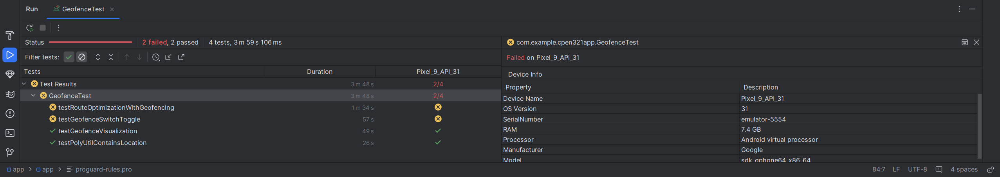
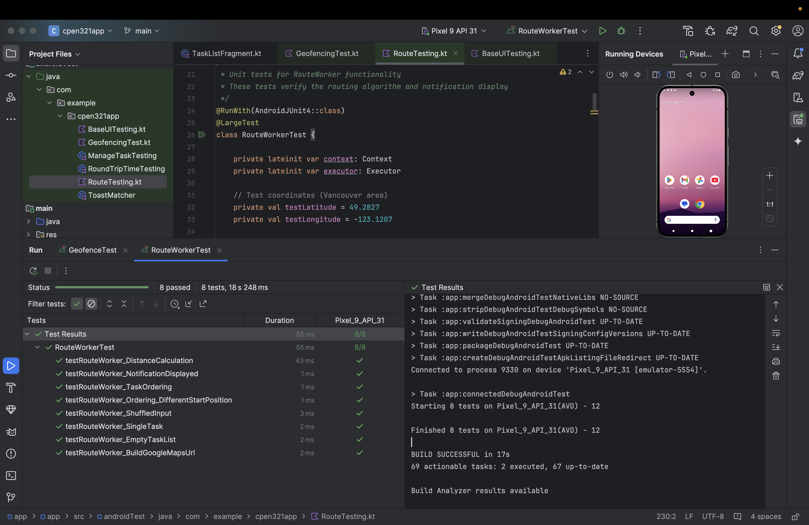

# M5: Testing and Code Review

## 1. Change History

| **Change Date**   | **Modified Sections** | **Rationale** |
| ----------------- | --------------------- | ------------- |
| _Nothing to show_ |

---

## 2. Back-end Test Specification: APIs

### 2.1. Locations of Back-end Tests and Instructions to Run Them

#### 2.1.1. Tests

| **Interface**                 | **Describe Group Location, No Mocks**                | **Describe Group Location, With Mocks**            | **Mocked Components**              |
| ----------------------------- | ---------------------------------------------------- | -------------------------------------------------- | ---------------------------------- |
| **POST /fetchGeofences**          | [`backend_test/backend_nomock.test.ts#L241`](#) | [`backend_test/backend_mock.test.ts#L285`](#) | Google Road API|
| **POST /fetchOptimalRoute**       | [`backend_test/backend_nomock.test.ts#L292`](#) | [`backend_test/backend_mock.test.ts#L389`](#) | Google Distance Matrix API, Database |
| **POST /addTask** | [`backend_test/backend_nomock.test.ts#L137`](#)  | [`backend_test/backend_mock.test.ts#L177`](#)  | Database                               |
| **POST /deleteTask** | [`backend_test/backend_nomock.test.ts#L199`](#)  | [`backend_test/backend_mock.test.ts#L244`](#)  | Datebase                        |
| **POST /login** | [`backend_test/backend_nomock.test.ts#L101`](#)  | [`backend_test/backend_mock.test.ts#L130`](#)  | Datebase                        |
| **POST /getAllTasks** | [`backend_test/backend_nomock.test.ts#L26`](#)  | [`backend_test/backend_mock.test.ts#L79`](#)  | Datebase                        |

#### 2.1.2. Commit Hash Where Tests Run

`c39b5db38337a315b12c525483ae9ffcb8bce6d2`

#### 2.1.3. Explanation on How to Run the Tests

- **Run on Github Action**:
  1. Click on the **"Actions"** tab
  2. Select **"Run Backend Jest Tests"** from the left panel.
  3. Click **"Run Workflow"**
  5. Wait for the results
  
- **Run in Terminal**:
  1. Open your terminal and run
    ```
     git clone https://github.com/bvpenner/CPEN321Project.git
     ```
  2. Go to test repository
    ```
    cd backend_test
    ```
  3. Run test using npx
    ```
    npx jest nonfunctional.test.ts --preset=ts-jest
    npx jest backend_nomock.test.ts backend_mock.test.ts --coverage --runInBand
    ```


### 2.2. GitHub Actions Configuration Location

`~/.github/workflows/backend-tests.yml`

### 2.3. Jest Coverage Report Screenshots With Mocks


### 2.4. Jest Coverage Report Screenshots Without Mocks


---

## 3. Back-end Test Specification: Tests of Non-Functional Requirements

### 3.1. Non-Functional Tests

| **Non-Functional Requirement**  | **Location in Git**                              |
| ------------------------------- | ------------------------------------------------ |
| **Scalability Test (Response Time)** | [`backend_test/nonfunctional.test.ts`](#) |
| **Notification Accuracy**          | [`backend_test/nonfunctional.test.ts`](#) |

### 3.2. Test Verification and Logs

- **Scalability Test (Response Time)**

  - **Verification:** The Scalability Test - API Response Time ensures that the system maintains optimal performance under expected loads. This test measures the response time of an example API, /getAllTasks, verifying that it completes within 200 milliseconds, aligning with industry standards. This test validates that the API remains efficient and responsive under typical usage conditions.

- **Notification Accuracy**
  - **Verification:** The Notification Accuracy - HTTP Response Time test ensures that the notification API responds promptly to user requests. It measures the response time of the /getAllTasks endpoint, verifying that it completes within 2 seconds. This test helps confirm that the system can deliver timely notifications, supporting a smooth and responsive user experience.

 - **Log Output**

---

## 4. Front-end Test Specification

### 4.1. Location in Git of Front-end Test Suite:

Base Testing Structure:
`app/app/src/androidTest/java/com/example/cpen321app/BaseUITesting.kt`

Manage Tasks:
`app/app/src/androidTest/java/com/example/cpen321app/ManageTaskTesting.kt`

Find Optimal Route:
`app/app/src/androidTest/java/com/example/cpen321app/RouteTesting.kt`

Task Geofencing:
`app/app/src/androidTest/java/com/example/cpen321app/GeofencingTest.kt`


### 4.2. Tests

- **Use Case: Manage Tasks**

  - **Success Scenarios**

    - **Add Task and Delete Task**

      - **Add Task**

        - **Expected Behaviors:**
          | **Scenario Steps** | **Test Case Steps** |
          | ------------------ | ------------------- |
          | 1. User clicks the add task button. | Open “Add Task” Activity. |
          | 2. User inputs details of the task including name, description, start time, end time, duration, latitude, longitude, and priority. | Insert task name, description, start time, end time, duration, latitude, longitude, and priority in respective fields. |
          | 3. User clicks “Create Task” button. | Click button labelled “Create Task”. |
          | 4. User can see an updated task list with new task added in task view. | Check that an activity matching the entered task name exists. |

      - **Delete Task**

        - **Expected Behaviors:**
          | **Scenario Steps** | **Test Case Steps** |
          | ------------------ | ------------------- |
          | 1. User selects an existing task from the Task View by long pressing on the task. | Long press on the previous created task in “Add Task”. |
          | 2. A window pops up prompting user to delete the task. | Check that pop up window with delete is shown. |
          | 3. User clicks “Create Task” button. | Click button labelled “Create Task”. |
          | 4. User can see an updated task list with new task added in task view. | Check that an activity matching the entered task name exists. |

      - **Test Logs:**
        

  - **Failure Scenarios**

    - **Add Task: Invalid Latitude or Longitude**

      - **Expected Behaviors:**
        | **Scenario Steps** | **Test Case Steps** |
        | ------------------ | ------------------- |
        | 1. User clicks the add task button. | Open “Add Task” Activity. |
        | 2a. User inputs invalid longitude and latitude. | Insert correct task name, description, start time, end time, duration, and priority. Insert incorrect longitude or latitude. |
        | 2a1. Prompt user to input valid longitude or latitude. | Check that a snackbar with error message: “Valid Latitude/Longitude Required: Between -90 and 90 degrees/-180 and 180 degrees” |
      
        - **Test Logs:**
          
          

    - **User Fails to input some fields**

      - **Expected Behaviors:**
        | **Scenario Steps** | **Test Case Steps** |
        | ------------------ | ------------------- |
        | 1. User clicks the add task button. | Open “Add Task” Activity. |
        | 2a. User fails to input some fields. | Insert every field correctly except for name, start, end, duration, or priority, which are left blank. |
        | 2a1. Prompt user to input valid input. | Check that a snackbar with appropriate error message exists. |
      
        - **Test Logs:**
          
    

## Geofencing Test Cases (GFT)

| Test Case  | Scenario Steps                                                                                                                                                                                                                                                                              | Test Case Steps                                                                                                                                                                                                                                                                          |
|------------|---------------------------------------------------------------------------------------------------------------------------------------------------------------------------------------------------------------------------------------------------------------------------------------------|------------------------------------------------------------------------------------------------------------------------------------------------------------------------------------------------------------------------------------------------------------------------------------------|
| **GFT-01** | 1. User logs in and navigates to the Task List.<br>2. User adds a task with valid coordinates.<br>3. User verifies the task is created.<br>4. User enables geofencing for the task.<br>5. User navigates to the map view and sees the map displayed.                              | 1. Click "Add Task".<br>2. Enter valid task details (including coordinates, description, priority, and duration).<br>3. Click "Create Task".<br>4. Verify the task appears in the list.<br>5. Enable geofencing for the task.<br>6. Navigate to map view and check that the map is displayed. |
| **GFT-02** | 1. User logs in and navigates to the Task List.<br>2. User creates two tasks with valid coordinates.<br>3. User verifies both tasks are created.<br>4. User enables geofencing for each task.<br>5. User selects both tasks for route planning.<br>6. User triggers routing and views the map. | 1. Create two tasks with valid coordinates.<br>2. Verify both tasks appear in the list.<br>3. Enable geofencing for both tasks.<br>4. Select both tasks for routing.<br>5. Click "Plan Route".<br>6. Wait for the route notification and verify geofences on the map.                             |
| **GFT-03** | 1. The system performs a unit test of geofence visualization using point-in-polygon detection.<br>2. A point known to be inside the geofence is tested.<br>3. A point known to be outside the geofence is tested.                                                                 | 1. Verify that a point inside the polygon returns true.<br>2. Verify that a point outside the polygon returns false.                                                                                                                                                                  |
| **GFT-04** | 1. User logs in and navigates to the Task List.<br>2. User creates two tasks with valid coordinates.<br>3. User enables geofencing for the first task and verifies it on the map.<br>4. User returns to the Task List and enables geofencing for the second task.<br>5. User confirms both geofences are visible.  | 1. Create two tasks with valid coordinates.<br>2. Verify both tasks appear in the list.<br>3. Enable geofencing for the first task and check on the map.<br>4. Return to the Task List and enable geofencing for the second task.<br>5. Verify that both geofences are visible on the map.           |

  - **Test Logs:**
  
---
## RouteWorker Test Cases

| Test Case   | Scenario Steps                                                                                                                                                           | Test Case Steps                                                                                                                                                                                                                                                                                      |
|-------------|--------------------------------------------------------------------------------------------------------------------------------------------------------------------------|--------------------------------------------------------------------------------------------------------------------------------------------------------------------------------------------------------------------------------------------------------------------------------------------------------|
| **RTW-01**  | 1. The system executes the routing algorithm with an empty task list.                                                                                                   | 1. Create a test worker.<br>2. Call the routing method (orderTasksByNearestNeighbor) with an empty task list.<br>3. Verify that the returned list of ordered tasks is empty.                                                                                                                        |
| **RTW-02**  | 1. The system executes the routing algorithm with a single task.                                                                                                        | 1. Create a test worker.<br>2. Create a single task with valid details.<br>3. Call orderTasksByNearestNeighbor with a list containing this task.<br>4. Verify that one task is returned and that it matches the input task.                                                                |
| **RTW-03**  | 1. The system executes the routing algorithm with multiple tasks from a fixed starting point.                                                                           | 1. Create a test worker.<br>2. Create three tasks (Task A, Task B, Task C) with known coordinates.<br>3. Call orderTasksByNearestNeighbor with a fixed starting coordinate.<br>4. Verify that tasks are ordered as: Task A first, then Task B, and Task C last.                           |
| **RTW-04**  | 1. The system executes the routing algorithm from a different starting position.                                                                                       | 1. Create a test worker.<br>2. Create tasks (Task A, Task B, Task C) with known coordinates.<br>3. Set a different starting position (e.g., 49.30, -123.14).<br>4. Call orderTasksByNearestNeighbor with the new starting coordinates.<br>5. Verify the ordering is: Task C, Task B, then Task A. |
| **RTW-05**  | 1. The system executes the routing algorithm with tasks provided in a shuffled order, and orders them by distance.                                                       | 1. Create a test worker.<br>2. Create three tasks in a shuffled order (e.g., Task C, Task A, Task B).<br>3. Call orderTasksByNearestNeighbor with default starting coordinates.<br>4. Verify that the tasks are ordered by distance (e.g., Task A, then Task B, then Task C).             |
| **RTW-06**  | 1. The system displays a route notification when a route is planned.                                                                                                   | 1. Create a test worker.<br>2. Define a sample maps URL.<br>3. Call showRouteNotification using the maps URL.<br>4. Verify that the notification manager reports at least one active notification.                                                                                             |
| **RTW-07**  | 1. The system builds a Google Maps URL for a planned route.                                                                                                             | 1. Create a test worker.<br>2. Create two tasks with valid coordinates.<br>3. Invoke the URL-building method (buildGoogleMapsUrl) via reflection.<br>4. Verify that the generated URL includes origin coordinates, destination coordinates, and at least one waypoint.                     |
| **RTW-08**  | 1. The system computes distances between two sets of coordinates.                                                                                                       | 1. Create a test worker.<br>2. Retrieve the computeDistance method via reflection.<br>3. Compute the distance between two distinct points (e.g., UBC and Downtown Vancouver) and verify it is greater than 0.<br>4. Compute the distance for identical points and verify it equals 0 (within tolerance). |
---
---
  
   - **Test Logs:**
    
  
  ---

## 5. Automated Code Review Results

### 5.1. Commit Hash Where Codacy Ran

`60b4b658df7db2e666ad8899daf78c9a3e6b9d26`

### 5.2. Unfixed Issues per Codacy Category


### 5.3. Unfixed Issues per Codacy Code Pattern


### 5.4. Justifications for Unfixed Issues

- **Code Pattern: [Too many functions inside a/an file/class/object/interface always indicate a violation of the single responsibility principle. Maybe the file/class/object/interface wants to manage too many things at once.](https://app.codacy.com/gh/bvpenner/CPEN321Project/issues/current?patternIds=TooManyFunctions&categories=ErrorProne)**

  1. **Class 'MainActivity' with '12' functions detected. Defined threshold inside classes is set to '11'**

     - **Location in Git:** [`/app/app/src/main/java/com/example/cpen321app/MainActivity.kt#L70`](/app/app/src/main/java/com/example/cpen321app/MainActivity.kt#L70)
     - **Justification:** Refactoring this code into multiple classes doesn’t make much sense given that the main activity is the launching point for a lot of app functionality and thus would expected to have a lot of methods, especially given that it’s only a couple of methods over the threshold, and refactoring the code to allocate responsibility better is not within the time budget.

  2. **Class 'MapsFragment' with '19' functions detected. Defined threshold inside classes is set to '11'**

     - **Location in Git:** [`/app/app/src/main/java/com/example/cpen321app/MapsActivity.kt#L36`](/app/app/src/main/java/com/example/cpen321app/MapsActivity.kt#L36)
     - **Justification:** Refactoring this code to better suit the responsibility principle would be nice, however a lot of these methods rely on internal class data. Refactoring the code to allocate responsibility better is not within the time budget.

- **Code Pattern: [Others](https://app.codacy.com/gh/bvpenner/CPEN321Project/issues/current?patternIds=LongMethod&categories=ErrorProne)**

  1. **The function setUpUIComponents is too long (111). The maximum length is 60.**

     - **Location in Git:** [`/app/app/src/main/java/com/example/cpen321app/MainActivity.kt#L213`](/app/app/src/main/java/com/example/cpen321app/MainActivity.kt#L213)
     - **Justification:** This issue seems to be bugged. Code in the function was greatly reduced, but Codacy seems to have never updated it.
