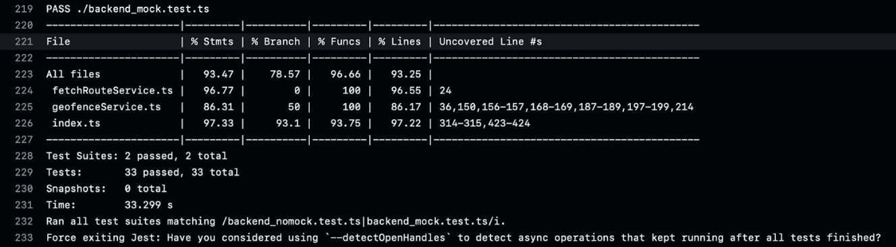
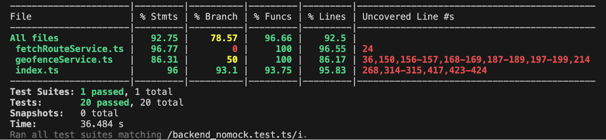
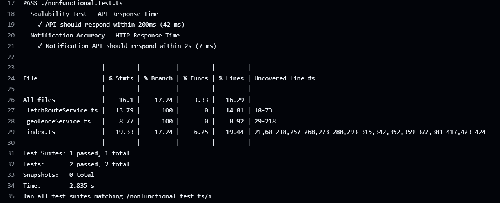
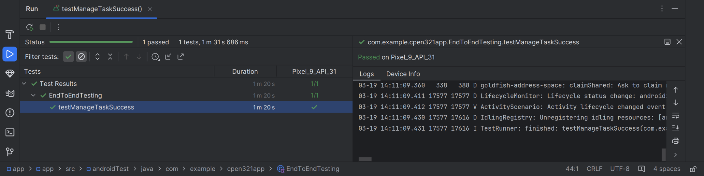
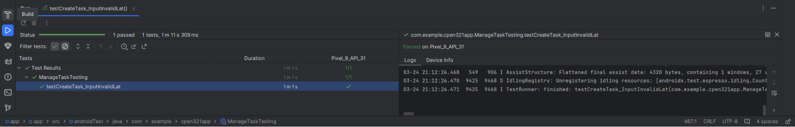
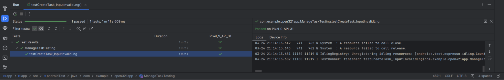
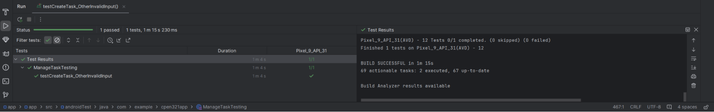
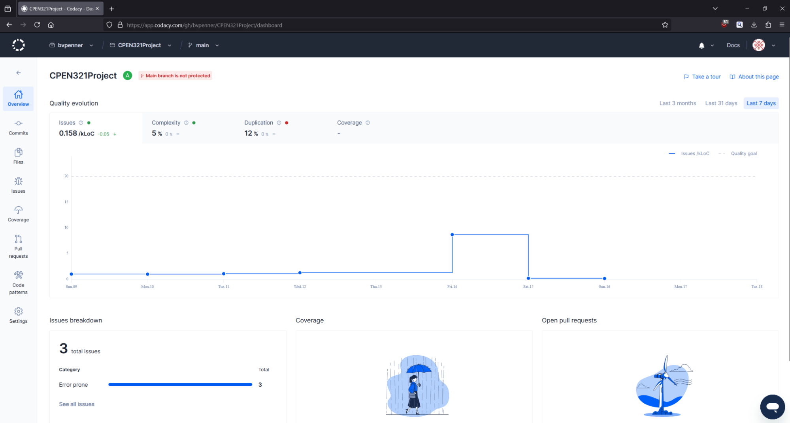
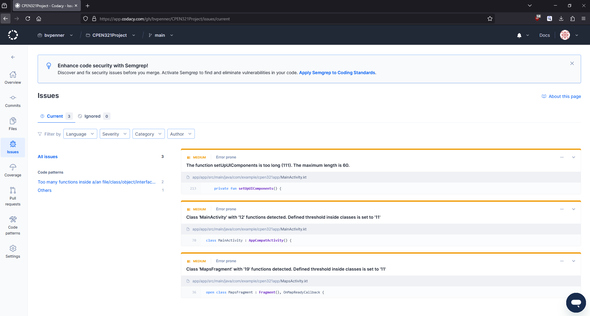

# M5: Testing and Code Review

## 1. Change History

| **Change Date**   | **Modified Sections** | **Rationale** |
| ----------------- | --------------------- | ------------- |
| _Nothing to show_ |

---

## 2. Back-end Test Specification: APIs

### 2.1. Locations of Back-end Tests and Instructions to Run Them

#### 2.1.1. Tests

| **Interface**                 | **Describe Group Location, No Mocks**                | **Describe Group Location, With Mocks**            | **Mocked Components**              |
| ----------------------------- | ---------------------------------------------------- | -------------------------------------------------- | ---------------------------------- |
| **POST /fetchGeofences**          | [`backend_test/backend_nomock.test.ts#L241`](#) | [`backend_test/backend_mock.test.ts#L285`](#) | Google Road API|
| **POST /fetchOptimalRoute**       | [`backend_test/backend_nomock.test.ts#L292`](#) | [`backend_test/backend_mock.test.ts#L389`](#) | Google Distance Matrix API, Database |
| **POST /addTask** | [`backend_test/backend_nomock.test.ts#L137`](#)  | [`backend_test/backend_mock.test.ts#L177`](#)  | Database                               |
| **POST /deleteTask** | [`backend_test/backend_nomock.test.ts#L199`](#)  | [`backend_test/backend_mock.test.ts#L244`](#)  | Datebase                        |
| **POST /login** | [`backend_test/backend_nomock.test.ts#L101`](#)  | [`backend_test/backend_mock.test.ts#L130`](#)  | Datebase                        |
| **POST /getAllTasks** | [`backend_test/backend_nomock.test.ts#L26`](#)  | [`backend_test/backend_mock.test.ts#L79`](#)  | Datebase                        |

#### 2.1.2. Commit Hash Where Tests Run

`c39b5db38337a315b12c525483ae9ffcb8bce6d2`

#### 2.1.3. Explanation on How to Run the Tests

- **Run on Github Action**:
  1. Click on the **"Actions"** tab
  2. Select **"Run Backend Jest Tests"** from the left panel.
  3. Click **"Run Workflow"**
  5. Wait for the results
  
- **Run in Terminal**:
  1. Open your terminal and run
    ```
     git clone https://github.com/bvpenner/CPEN321Project.git
     ```
  2. Go to test repository
    ```
    cd backend_test
    ```
  3. Run test using npx
    ```
    npx jest nonfunctional.test.ts --preset=ts-jest
    npx jest backend_nomock.test.ts backend_mock.test.ts --coverage --runInBand
    ```


### 2.2. GitHub Actions Configuration Location

`~/.github/workflows/backend-tests.yml`

### 2.3. Jest Coverage Report Screenshots With Mocks



### 2.4. Jest Coverage Report Screenshots Without Mocks



---

## 3. Back-end Test Specification: Tests of Non-Functional Requirements

### 3.1. Scalability Test

| **Non-Functional Requirement**  | **Location in Git**                              |
| ------------------------------- | ------------------------------------------------ |
| **Scalability Test (Response Time)** | [`backend_test/nonfunctional.test.ts`](#) |
| **Notification Accuracy**          | [`backend_test/nonfunctional.test.ts`](#) |

### 3.2. Test Verification and Logs

- **Scalability Test (Response Time)**

  - **Verification:** The Scalability Test - API Response Time ensures that the system maintains optimal performance under expected loads. This test measures the response time of an example API, /getAllTasks, verifying that it completes within 200 milliseconds, aligning with industry standards. This test validates that the API remains efficient and responsive under typical usage conditions.

- **Notification Accuracy**
  - **Verification:** The Notification Accuracy - HTTP Response Time test ensures that the notification API responds promptly to user requests. It measures the response time of the /getAllTasks endpoint, verifying that it completes within 2 seconds. This test helps confirm that the system can deliver timely notifications, supporting a smooth and responsive user experience.

 - **Log Output**

---

## 4. Front-end Test Specification

### 4.1. Location in Git of Front-end Test Suite:

Base Testing Structure:
`app/app/src/androidTest/java/com/example/cpen321app/BaseUITesting.kt`

Manage Tasks:
`app/app/src/androidTest/java/com/example/cpen321app/ManageTaskTesting.kt`

Find Optimal Route:
`app/app/src/androidTest/java/com/example/cpen321app/RouteTesting.kt`

Task Geofencing:
`app/app/src/androidTest/java/com/example/cpen321app/GeofencingTest.kt`


### 4.2. Tests

- **Use Case: Manage Tasks**

  - **Success Scenarios**

    - **Add Task and Delete Task**

      - **Add Task**

        - **Expected Behaviors:**
          | **Scenario Steps** | **Test Case Steps** |
          | ------------------ | ------------------- |
          | 1. User clicks the add task button. | Open “Add Task” Activity. |
          | 2. User inputs details of the task including name, description, start time, end time, duration, latitude, longitude, and priority. | Insert task name, description, start time, end time, duration, latitude, longitude, and priority in respective fields. |
          | 3. User clicks “Create Task” button. | Click button labelled “Create Task”. |
          | 4. User can see an updated task list with new task added in task view. | Check that an activity matching the entered task name exists. |

      - **Delete Task**

        - **Expected Behaviors:**
          | **Scenario Steps** | **Test Case Steps** |
          | ------------------ | ------------------- |
          | 1. User selects an existing task from the Task View by long pressing on the task. | Long press on the previous created task in “Add Task”. |
          | 2. A window pops up prompting user to delete the task. | Check that pop up window with delete is shown. |
          | 3. User clicks “Create Task” button. | Click button labelled “Create Task”. |
          | 4. User can see an updated task list with new task added in task view. | Check that an activity matching the entered task name exists. |

      - **Test Logs:**
        

  - **Failure Scenarios**

    - **Add Task: Invalid Latitude or Longitude**

      - **Expected Behaviors:**
        | **Scenario Steps** | **Test Case Steps** |
        | ------------------ | ------------------- |
        | 1. User clicks the add task button. | Open “Add Task” Activity. |
        | 2a. User inputs invalid longitude and latitude. | Insert correct task name, description, start time, end time, duration, and priority. Insert incorrect longitude or latitude. |
        | 2a1. Prompt user to input valid longitude or latitude. | Check that a snackbar with error message: “Valid Latitude/Longitude Required: Between -90 and 90 degrees/-180 and 180 degrees” |
      
        - **Test Logs:**
          
          

    - **User Fails to input some fields**

      - **Expected Behaviors:**
        | **Scenario Steps** | **Test Case Steps** |
        | ------------------ | ------------------- |
        | 1. User clicks the add task button. | Open “Add Task” Activity. |
        | 2a. User fails to input some fields. | Insert every field correctly except for name, start, end, duration, or priority, which are left blank. |
        | 2a1. Prompt user to input valid input. | Check that a snackbar with appropriate error message exists. |
      
        - **Test Logs:**
          
    

  ## Geofencing Test Cases (GFT)
  
  | Test Case  | Scenario Steps                                                                                                                                                                                                                      | Test Case Steps                                                                                                                                                                                                                       |
  |------------|-------------------------------------------------------------------------------------------------------------------------------------------------------------------------------------------------------------------------------------|---------------------------------------------------------------------------------------------------------------------------------------------------------------------------------------------------------------------------------------|
  | **GFT-01** | 1. User logs in and navigates to the Task List.<br>2. User opens the "Add Task" activity.<br>3. User enters valid task details.<br>4. User creates the task and enables geofencing, then views the map.                          | 1. Click "Add Task".<br>2. Enter valid details (Name, Description, Start/End Time, Duration, Latitude, Longitude, Priority).<br>3. Click "Create Task".<br>4. Toggle geofencing and verify the geofence is visible on the map.  |
  | **GFT-02** | 1. User logs in and navigates to the Task List.<br>2. User opens the "Add Task" activity.<br>3. User enters task details with invalid coordinates.<br>4. User attempts to create the task.                                  | 1. Click "Add Task".<br>2. Enter valid details except for coordinates (e.g., latitude: 100.0, longitude: 50.0).<br>3. Click "Create Task".<br>4. Verify an error message is displayed indicating valid latitude/longitude are required.  |
  | **GFT-03** | 1. User logs in and navigates to the Task List.<br>2. User opens the "Add Task" activity.<br>3. User enters task details with invalid coordinates.<br>4. User attempts to create the task.                                  | 1. Click "Add Task".<br>2. Enter valid details except for coordinates (e.g., latitude: 40.0, longitude: 300.0).<br>3. Click "Create Task".<br>4. Verify an error message is displayed indicating valid latitude/longitude are required. |
  | **GFT-04** | 1. User logs in and navigates to the Task List.<br>2. User creates two tasks with valid coordinates.<br>3. User enables geofencing on both tasks.<br>4. User selects both tasks for route optimization and plans a route.<br>5. User views the map to verify geofence visualization and route notification. | 1. Create tasks with valid coordinates.<br>2. Enable geofencing for both tasks.<br>3. Select tasks and click "Plan Route".<br>4. Verify a notification indicating a new route is displayed.<br>5. Navigate to map view and verify geofences for both tasks. |
  | **GFT-05** | 1. System verifies geofence visualization using PolyUtil’s point-in-polygon detection.                                                                                                                                              | 1. Verify that a point inside the polygon returns true.<br>2. Verify that a point outside the polygon returns false.                                                                                                  |
  | **GFT-06** | 1. User logs in and navigates to the Task List.<br>2. User creates two tasks with valid coordinates.<br>3. User toggles the geofence switch for each task individually.                                                     | 1. Add two tasks with valid coordinates.<br>2. Enable geofencing for the first task and verify on map.<br>3. Return to the Task List and enable geofencing for the second task.<br>4. Verify both geofences are visible on the map.  |
  
  
    - **Test Logs:**
      ```
      [Placeholder for Espresso test execution logs]
      ```
  ## Route Optimization and Notification Test Cases (RTT)
  
    | Test Case  | Scenario Steps                                                                                                                                                                  | Test Case Steps                                                                                                                                                                  |
    |------------|---------------------------------------------------------------------------------------------------------------------------------------------------------------------------------|----------------------------------------------------------------------------------------------------------------------------------------------------------------------------------|
    | **RTT-01** | 1. User logs in and navigates to the Task List.<br>2. User creates two tasks.<br>3. User selects both tasks.<br>4. User plans a route.                                     | 1. Log in.<br>2. Create two tasks with valid details.<br>3. Select tasks from the list.<br>4. Click "Plan Route" and confirm successful route planning.        |
    | **RTT-02** | 1. User logs in and navigates to the Task List.<br>2. User attempts to plan a route without selecting any tasks.                                                            | 1. Log in.<br>2. Navigate to the Task List.<br>3. Click "Plan Route" without selecting tasks.<br>4. Verify the system responds appropriately (e.g., no route created or an error message is displayed).  |
    | **RTT-03** | 1. User logs in and navigates to the Task List.<br>2. User creates multiple tasks at various distances.<br>3. User selects the tasks.<br>4. User plans a route.<br>5. System orders the tasks based on proximity. | 1. Create multiple tasks at known distances.<br>2. Select tasks and click "Plan Route".<br>3. Verify tasks are ordered correctly using the nearest neighbor routing algorithm.  |
    | **RTT-04** | 1. User plans a route.<br>2. User receives a route notification.                                                                                                             | 1. Click "Plan Route".<br>2. Verify that a route notification is displayed and active.                                                                           |
    | **RTT-05** | 1. System generates a Google Maps URL for the planned route.                                                                                                                  | 1. Plan a route.<br>2. Verify the generated URL contains correct coordinates for origin, destination, and waypoints.                                                   |
    | **RTT-06** | 1. System calculates distances between two points.                                                                                                                           | 1. Verify that the calculated distance is correct between two known points (e.g., UBC and Downtown Vancouver).<br>2. Verify that the distance is zero when the points are identical. |
    
    ---
  
    - **Test Logs:**
      ```
      [Placeholder for Espresso test execution logs]
      ```
  
  ---

## 5. Automated Code Review Results

### 5.1. Commit Hash Where Codacy Ran

`60b4b658df7db2e666ad8899daf78c9a3e6b9d26`

### 5.2. Unfixed Issues per Codacy Category



### 5.3. Unfixed Issues per Codacy Code Pattern



### 5.4. Justifications for Unfixed Issues

- **Code Pattern: [Too many functions inside a/an file/class/object/interface always indicate a violation of the single responsibility principle. Maybe the file/class/object/interface wants to manage too many things at once.](https://app.codacy.com/gh/bvpenner/CPEN321Project/issues/current?patternIds=TooManyFunctions&categories=ErrorProne)**

  1. **Class 'MainActivity' with '12' functions detected. Defined threshold inside classes is set to '11'**

     - **Location in Git:** [`/app/app/src/main/java/com/example/cpen321app/MainActivity.kt#L70`](/app/app/src/main/java/com/example/cpen321app/MainActivity.kt#L70)
     - **Justification:** Refactoring this code into multiple classes doesn’t make much sense given that the main activity is the launching point for a lot of app functionality and thus would expected to have a lot of methods, especially given that it’s only a couple of methods over the threshold, and refactoring the code to allocate responsibility better is not within the time budget.

  2. **Class 'MapsFragment' with '19' functions detected. Defined threshold inside classes is set to '11'**

     - **Location in Git:** [`/app/app/src/main/java/com/example/cpen321app/MapsActivity.kt#L36`](/app/app/src/main/java/com/example/cpen321app/MapsActivity.kt#L36)
     - **Justification:** Refactoring this code to better suit the responsibility principle would be nice, however a lot of these methods rely on internal class data. Refactoring the code to allocate responsibility better is not within the time budget.

- **Code Pattern: [Others](https://app.codacy.com/gh/bvpenner/CPEN321Project/issues/current?patternIds=LongMethod&categories=ErrorProne)**

  1. **The function setUpUIComponents is too long (111). The maximum length is 60.**

     - **Location in Git:** [`/app/app/src/main/java/com/example/cpen321app/MainActivity.kt#L213`](/app/app/src/main/java/com/example/cpen321app/MainActivity.kt#L213)
     - **Justification:** This issue seems to be bugged. Code in the function was greatly reduced, but Codacy seems to have never updated it.
